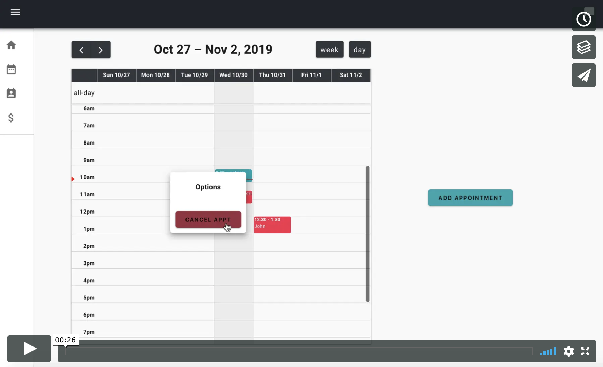
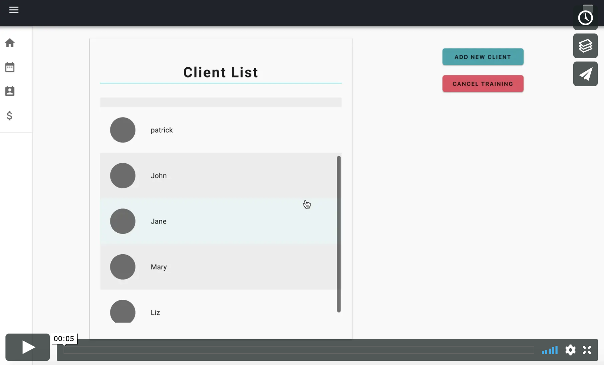

# Client Management App
A proof of concept application where trainers can schedule and manage appointments and track their clients progress.

## Current Features 
#### Add/Cancel Appointments

https://vimeo.com/369850048
#### Add Clients

## Technologies Used
* React
* Redux
* FullCalendar
* Node.js
* Express
* PostgreSQL
* Sequelize
